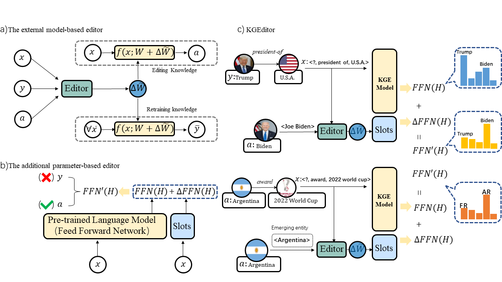

<div align="center">
    <!--  -->
    <h1> DeltaKG </h1>
    <p> <b>
        A dynamic, PLM-based library for Knowledge Graph Embeddings.</b>
    </p>
    
------

<p align="center">
  <a href="#overview">Overview</a> •
  <a href="#installation">Installation</a> •
  <a href="#how-to-run">How To Run</a> •
  <a href="https://arxiv.org/pdf/2301.10405">Paper</a> •
  <a href="https://medium.com/@jack16900/deltakg-a-library-for-dynamically-editing-plm-based-kg-embeddings-243d59a8f168">Medium</a> •
  <a href="#how-to-cite">Citation</a> •
  <a href="#other-kg-representation-open-source-projects">Others</a> 
</p>
</div>

## Overview
Knowledge graph embedding (KGE) is a method for representing symbolic facts in low-dimensional vector spaces, with the goal of projecting relations and entities into a continuous vector space. This approach enhances knowledge reasoning capabilities and facilitates application to downstream tasks.

We introduce DeltaKG (MIT License), a dynamic, PLM-based library for KGEs that equips with numerous baseline models, such as K-Adapter, CaliNet, KnowledgeEditor, MEND, and KGEditor, and supports a variety of datasets, including E-FB15k237, A-FB15k237, E-WN18RR, and A-WN18RR.

**DeltaKG** is now publicly open-sourced, with [a demo](https://huggingface.co/spaces/zjunlp/KGEditor), [a leaderboard](https://zjunlp.github.io/project/KGE_Editing/) and long-term maintenance.
<!-- - ❗NOTE: We provide some KGE baselines at [OpenBG-IMG](https://github.com/OpenBGBenchmark/OpenBG-IMG). -->

## Model Architecture

<div align=center>

</div>

 Illustration of KGEditor for a) The external model-based editor, b) The additional parameter-based editor and c) KGEditor.

## Installation

**Step1** Download the basic code

```bash
git clone --depth 1 https://github.com/zjunlp/PromptKG.git
```

**Step2** Create a virtual environment using `Anaconda` and enter it
```bash
conda create -n deltakg python=3.8
conda activate deltakg
```
**Step3** Enter the task directory and install library
```bash
cd PromptKG/deltaKG
pip install -r requirements.txt
```

## Data & Checkpoints Download

### Data

The datasets that we used in our experiments are as follows,

- E-FB15k237

    This dataset is based on FB15k237 and a pre-trained language-model-based KGE. You can download the E-FB15k237 dataset from [Google Drive](https://drive.google.com/drive/folders/1K1gag6eTCJ-x7WM-zbn6IRGX_B9fy4hD?usp=share_link).

For other datasets `A-FB15k237`, `E-WN18RR`, and `A-WN18RR`, you can also download from the above link.

### Checkpoints

The checkpoints that we used in our experiments are as follows,

- PT_KGE_E-FB15k237

    This checkpoint is based on FB15k237 and a pre-trained language model. You can download the PT_KGE_E-FB15k237 checkpoint from [Google Drive](https://drive.google.com/drive/folders/1EOHdg8rC9iwgSyKl5RnEv9z6ATW5Ntbr?usp=share_link).

For other checkpoints `PT_KGE_A-FB15k237`, `PT_KGE_E-WN18RR`, and `PT_KGE_A-WN18RR`, you can also download from the above link.

The expected structure of files is:

```
DeltaKG
 |-- checkpoints  # checkpoints for tasks
 |-- datasets  # task data
 |    |-- FB15k237  # dataset's name
 |    |    |-- AddKnowledge  # data for add task, A-FB15k237
 |    |    |    |-- train.jsonl    
 |    |    |    |-- dev.jsonl     
 |    |    |    |-- test.jsonl     
 |    |    |    |-- stable.jsonl  
 |    |    |    |-- relation2text.txt  
 |    |    |    |-- relation.txt 
 |    |    |    |-- entity2textlong.txt   
 |    |    |-- EditKnowledge # data for edit task, E-FB15k237
 |    |    |    |-- ... #  consistent with A-FB15k237
 |    |-- WN18RR  # dataset's name
 |    |    |-- AddKnowledge  # data for add task, A-WN18RR
 |    |    |    |-- train.jsonl    
 |    |    |    |-- dev.jsonl     
 |    |    |    |-- test.jsonl     
 |    |    |    |-- stable.jsonl  
 |    |    |    |-- relation2text.txt  
 |    |    |    |-- relation.txt 
 |    |    |    |-- entity2text.txt   
 |    |    |-- EditKnowledge # data for edit task, E-WN18RR
 |    |    |    |-- ... #  consistent with A-WN18RR
 |-- models  # KGEditor and baselines
 |    |-- CaliNet
 |    |    |-- run.py    
 |    |    |-- ...
 |    |-- K-Adapter
 |    |-- KE  # KnowledgeEditor
 |    |-- KGEditor
 |    |-- MEND
 |-- resource  # image resource
 |-- scripts  # running scripts
 |    |-- CaliNet
 |    |    |-- CaliNet_FB15k237_edit.sh
 |    |    |-- ...
 |    |-- K-Adapter
 |    |-- KE  # KnowledgeEditor
 |    |-- KGEditor
 |    |-- MEND
 |-- src
 |    |-- data       # data process functions
 |    |-- models     # source code of models
 |-- README.md
 |-- requirements.txt
 |-- run.sh  #  script to quick start

```

## How to run

- ### script

  - The script `run.sh` has three arguments `-m`, `-d`, and `-t`, which stand for model, dataset, and task.
    - `-m`: should be the name of a model in models (e.g. `KGEditor`, `MEND`, `KE`);
    - `-d`: should be either `FB15k237` or `WN18RR`;
    - `-t`: should be either `edit` or `add`.

- ### Edit Task

  - To train the `KGEditor` model in the paper on the dataset `E-FB15k237`, run the command below.

    ```shell
        bash run.sh -m KGEditor -d FB15k237 -t edit
    ```
  
  - To train the `KGEditor` model in the paper on the dataset `E-WN18RR`, run the command below.

    ```shell
        bash run.sh -m KGEditor -d WN18RR -t edit
    ```

- ### Add Task

  - To train the `KGEditor` model in the paper on the dataset `A-FB15k237`, run the command below.

    ```shell
        bash run.sh -m KGEditor -d FB15k237 -t add
    ```
  
  - To train the `KGEditor` model in the paper on the dataset `A-WN18RR`, run the command below.

    ```shell
        bash run.sh -m KGEditor -d WN18RR -t add
    ```

## Experiments

Up to now, baseline models include K-Adapter, CaliNet, KE, MEND, and KGEditor. The results of these models are as follows,

- E-FB15k237
  
  |Model   | $Succ@1$ | $Succ@3$ | $ER_{roc}$ | $RK@3$ | $RK_{roc}$ |
  |:-:  |:-: |:-:  |:-:  |:-:  |:-: |
  |Finetune |0.472|0.746|0.998|0.543|0.977|
  |Zero-Shot Learning |0.000|0.000|-|1.000|0.000|
  |K-Adapter |0.329|0.348|0.926|0.001|0.999|
  |CaliNet |0.328|0.348|0.937|0.353|0.997|
  |KE |0.702|0.969|0.999|0.912|0.685|
  |MEND |0.828|0.950|0.954|0.750|0.993|
  |KGEditor |0.866|0.986|0.999|0.874|0.635|

- E-WN18RR
  
  |Model   | $Succ@1$ | $Succ@3$ | $ER_{roc}$ | $RK@3$ | $RK_{roc}$ |
  |:-:  |:-: |:-:  |:-:  |:-:  |:-: |
  |Finetune |0.758|0.863|0.998|0.847|0.746|
  |Zero-Shot Learning |0.000|0.000|-|1.000|0.000|
  |K-Adapter |0.638|0.752|0.992|0.009|0.999|
  |CaliNet |0.538|0.649|0.991|0.446|0.994|
  |KE |0.599|0.682|0.978|0.935|0.041|
  |MEND |0.815|0.827|0.948|0.957|0.772|
  |KGEditor |0.833|0.844|0.991|0.956|0.256|

- A-FB15k237

  |Model   | $Succ@1$ | $Succ@3$ | $ER_{roc}$ | $RK@3$ | $RK_{roc}$ |
  |:-:  |:-: |:-:  |:-:  |:-:  |:-: |
  |Finetune |0.906|0.976|0.999|0.223|0.997|
  |Zero-Shot Learning |0.000|0.000|-|1.000|0.000|
  |K-Adapter |0.871|0.981|0.999|0.000|0.999|
  |CaliNet |0.714|0.870|0.997|0.034|0.999|
  |KE |0.648|0.884|0.997|0.926|0.971|
  |MEND |0.517|0.745|0.991|0.499|0.977|
  |KGEditor |0.796|0.923|0.998|0.899|0.920|

- A-WN18RR

  |Model   | $Succ@1$ | $Succ@3$ | $ER_{roc}$ | $RK@3$ | $RK_{roc}$ |
  |:-:  |:-: |:-:  |:-:  |:-:  |:-: |
  |Finetune |0.997|0.999|0.999|0.554|0.996|
  |Zero-Shot Learning |0.000|0.000|-|1.000|0.000|
  |K-Adapter |0.898|0.978|0.999|0.002|0.999|
  |CaliNet |0.832|0.913|0.995|0.511|0.989|
  |KE |0.986|0.996|0.999|0.975|0.090|
  |MEND |0.999|1.0|0.999|0.810|0.987|
  |KGEditor |0.998|1.0|0.999|0.956|0.300|

We are still trying different hyper-parameters and training strategies for these models, and may add new models to this table. We also provide a [leaderboard](https://zjunlp.github.io/project/KGE_Editing/) and a [demo](https://huggingface.co/spaces/zjunlp/KGEditor).

## Citation

If you use or extend our work, please cite the paper as follows:

```bibtex
@article{cheng2023editing,
  title={Editing Language Model-based Knowledge Graph Embeddings},
  author={Cheng, Siyuan and Zhang, Ningyu and Tian, Bozhong and Dai, Zelin and Xiong, Feiyu and Guo, Wei and Chen, Huajun},
  journal={arXiv preprint arXiv:2301.10405},
  year={2023}
}
```

## Other KG Representation Open-Source Projects

- [OpenKE](https://github.com/thunlp/OpenKE)
- [LibKGE](https://github.com/uma-pi1/kge)
- [CogKGE](https://github.com/jinzhuoran/CogKGE)
- [PyKEEN](https://github.com/pykeen/pykeen)
- [GraphVite](https://graphvite.io/)
- [Pykg2vec](https://github.com/Sujit-O/pykg2vec)
- [PyG](https://github.com/pyg-team/pytorch_geometric)
- [CogDL](https://github.com/THUDM/cogdl)
- [NeuralKG](https://github.com/zjukg/NeuralKG)
- [KGxBoard](https://github.com/neulab/KGxBoard)
