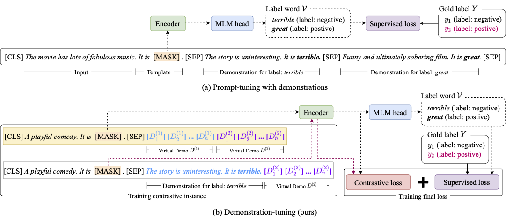

# Demo-Tuning

This is the implement of the paper ["Contrastive Demonstration Tuning for Pre-trained Language Models"](https://arxiv.org/pdf/2204.04392.pdf). Demo-Tuning is a novel pluggable, extensible, and efficient approach with contrastive demonstration tuning, which is free of demonstration sampling.

<div align=center></div>

## Quick links

* [Overview](#overview)
* [Requirements](#requirements)
* [Data Preparation](#data-preparation)
* [Contrastive Demonstration Tuning](#demo-tuning)
* [Citation](#citation)

## Overview

Recent works have focused on automatically searching discrete or continuous prompts or optimized verbalizers, yet studies for the demonstration are still limited. Concretely, the demonstration examples are crucial for an excellent final performance of prompt-tuning. In this paper, we propose a novel pluggable, extensible, and efficient approach named **contrastive demonstration tuning**, which is free of demonstration sampling.

## Requirements

To run our code, please install dependency packages as following.

python3 / pytorch 1.9 / transformers 4.9.2

## Data Preparation

To evaluate Demo-Tuning, we conduct experiments on 6 tasks from GLUE leaderboard and 10 other popular classification tasks, including natural language inference (SNLI, MNLI, QNLI, RTE), sentiment classification (SST-2, SST-5, MR, CR, MPQA), paraphrase and similarity (MRPC, QQP) and sentence classification (DBpedia, Subj, TREC, Yahoo! Answers). The datasets for tasks mentioned above, are all open and common.

### Few-shot training data and evaluation data

The reference directory:
```text
├── DemoTuning         
|  └── tools
|     └── generate_kshot_data.py
|  └── src
|     └── data_processor.py
|     └── dataset.py
|     └── models.py
|     └── tokenizer.py
|     └── trainer.py
|     └── training_args.py
|     └── utils.py
|  └── script
|     └── run.sh
|  └── data
|     └── output_data
|     └── model_data
|        └── roberta_large
|        └── ...
|     └── training_data
|     └── original_data
```

You can put the original downloaded data in `data/original_data`  and run script `tools/generate_kshot_data.py`  to generate training data and evaluation data. For example, you can construct SST-2 dataset by following command:

```shell
python tools/generate_kshot_data.py \
	--k 16 \
	--task SST-2 \
	--seed 2021 \
	--data_dir data/original_data/glue \
	--output_dir data/training_data \
```

## Contrastive Demonstration Tuning

You can run script `bash script/run.sh` to train our model and evaluate. The related parameters are all ensembled in this script, you can adjust parameters by yourself. Listing main parameters in `run.sh`:

```shell
# {`finetune`, `prompt`}
TYPE="prompt"
MODEL="data/model_data/roberta_large"
MODEL_NAME="roberta_large"

# set training arguments
K=16
BS=8
LR=1e-5
MAX_STEP=800
EVAL_STEP=80
MAX_LENGTH=128
DEMO_MAX_LENGTH=128

# prompt template and verbalizer
TEMPLATE=*cls**sent_0*_It_was*mask*.*sep+*
MAPPING="{'0':'terrible','1':'great'}"

# demonstration
DEMO=true
DEMO_TEMPLATE=*sent_0*_It_was*mask*.

# set virtual demonstration
VIRTUAL_DEMO_INIT="random"
VIRTUAL_DEMO_LENGTH_PER_LABEL=2
LAMBDA_CL=1.0
```

## Citation

```bibtex
@article{DBLP:journals/corr/abs-2204-04392,
  author    = {Xiaozhuan Liang and
               Ningyu Zhang and
               Siyuan Cheng and
               Zhen Bi and
               Zhenru Zhang and
               Chuanqi Tan and
               Songfang Huang and
               Fei Huang and
               Huajun Chen},
  title     = {Contrastive Demonstration Tuning for Pre-trained Language Models},
  journal   = {CoRR},
  volume    = {abs/2204.04392},
  year      = {2022},
  url       = {https://doi.org/10.48550/arXiv.2204.04392},
  doi       = {10.48550/arXiv.2204.04392},
  eprinttype = {arXiv},
  eprint    = {2204.04392},
  timestamp = {Wed, 13 Apr 2022 14:34:17 +0200},
  biburl    = {https://dblp.org/rec/journals/corr/abs-2204-04392.bib},
  bibsource = {dblp computer science bibliography, https://dblp.org}
}
```
